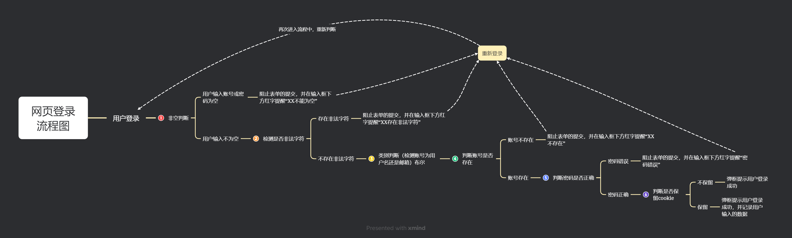
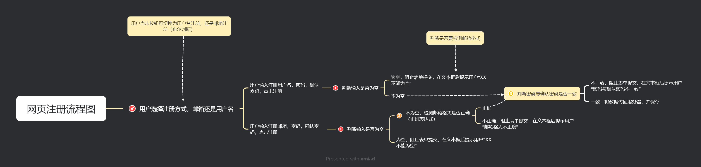

# 基础的网页框架
这个项目的基本目标为以规范的代码风格，文件管理，实现网页的登录，注册，功能，并完成基本的美化

## 功能介绍
### 登录页面包含以下功能

1. 账号，密码的非空判断
2. 非法字符的检测
3. 账号类型的识别
4. 账号的查询与判断
5. 保留用户cookie

#### 流程如图所示



### 注册页面包含以下功能
1. 注册账号，密码，确认密码的非空判断
2. 2判断用户注册账号类型
3. 判断用户邮箱格式是否正确
4. 保存用户填写数据，并传回服务器

- 流程如图所示


### 首页
首页暂且为静态网页仅仅做展示功能

### 代码规范与文件管理
#### 文件存放格式

项目

* mockup：存放演示数据
* script：存放脚本
* src：存放源码
* style：存放样式
* venfor：存放外部库
* 项目文件夹中放html文件
    
```

│  CHANGELOG
│  log-in.html
│  readme.md
│  tree.txt
│  
├─docs
│      .gitkeep
│      
├─image
│      id.png
│      Login-process.png
│      person.png
│      rootop0.png
│      
├─mockup
│      json-test.json
│      
├─script
│      log-in.js
│      
├─src
│      home-page.html
│      sign-in.html
│      
├─style
│      log-in.css
│      
└─vendor
    └─bootstrap-5.3.0-alpha1-dist
        ├─css
        │     
        └─js

```

#### 代码规范

1. html，css ，js代码应分别存放，不要混在一起，尽量使用外联式
2. 所有提示语句，请放置在同一个json文件中，方便使用
3. js各个功能之间用函数分开写，各区域间不要相互干涉
4. 每个区域之间写好注释

#### 命名规范
1. 表单中所有用元素都需要加上类名
2. 函数命名使用驼峰命名法，第一个单词以小写字母开始，从第二个单词开始以后的每个单词的首字母都采用大写字母，如`myName`，并在其后写明功能
3. 参数命名使用下划线命名法，每个字母间使用下划线_来链接，如`check_name`，最后注释写明该参数的作用


